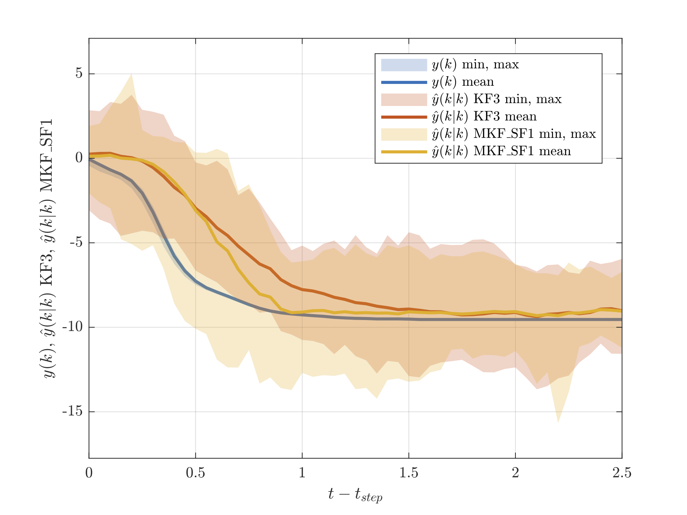

# thesis-sims

MATLAB code and data to reproduce the simulation results in my masters thesis report:

 - Tubbs, W. J., Multiple-Model Observers for Detecting Ore Feed Disturbances in Grinding Operations, Mémoire, May, 2023.



For the code to reproduce the results of the following conference paper, presented at the 19th Symposium on Control, Optimization and Automation in Mining, Mineral and Metal Processing ([IFAC MMM](https://ifacmmm2022.org)) in Montreal:

- Tubbs, W. J., Desbiens, A., and Bouchard, J. (2022). An Observer to Detect Infrequently-Occurring Disturbances in Grinding Operations.

Refer to this repository instead:
- [https://github.com/billtubbs/ifac-2022-mmkf](https://github.com/billtubbs/ifac-2022-mmkf)

The code has been tested with MATLAB versions 2019b, 2020b, and 2021b.  It may or may not work with other versions!

## 1. Generating RODD disturbances (section 3.1 of thesis report)

The files for these simulations are in the [`linear-sims`](linear-sims) sub-directory.  Navigate to this directory and then follow the instructions below.


## 2. Observer simulations with linear systems (section 3.2 of thesis report)

The files for these simulations are in the [`linear-sims`](linear-sims) sub-directory.  Navigate to this directory and then follow the instructions below.

### System models

The two systems considered are defined in the following files
 - [process-observers/sys_rodin_step.m](linear-sims/sys_rodin_step.m) - SISO linear system used in section 4.2.2
 - [process-observers/rodin_step_2x2sym2.m](linear-sims/rodin_step_2x2sym2.m) - 2x2 linear system used in section 4.2.3

### Process observers

 - [process-observers/obs_rodin_step.m](process-observers/obs_rodin_step.m)
 - [process-observers/obs_rodin_step_2x2_opt.m](process-observers/obs_rodin_step_2x2_opt.m)

### Tuning observer parameters

The observer parameters were chosen by running multiple simulations with different combinations of parameter values.  Run the following scripts in the sequence shown to generate the latex for the summary tables of observer parameter search results.  Note: these simulations can take a long time to run.

For the Kalman filter (KF3):
 - [linear-sims/gen_sim_specs_sim2_3KF_Q.m](linear-sims/gen_sim_specs_sim2_3KF_Q.m)
 - [linear-sims/run_obs_sims.m](linear-sims/run_obs_sims.m) with the line `sim_name = "rod_obs_sim2_3KF_seed"` uncommented
 - [linear-sims/rod_obs_sim2_MKF_SF95_popt_table.m](linear-sims/rod_obs_sim2_MKF_SF95_popt_table.m)

For the MKF_SF observer:
 - [linear-sims/gen_sim_specs_sim2_MKF_SF95_popt.m](linear-sims/gen_sim_specs_sim2_MKF_SF95_popt.m)
 - [linear-sims/run_obs_sims.m](linear-sims/run_obs_sims.m) with the line `sim_name = "rod_obs_sim2_MKF_SF95_popt"` uncommented
 - [linear-sims/rod_obs_sim2_MKF_SF95_popt_table.m](linear-sims/rod_obs_sim2_MKF_SF95_popt_table.m)

For the MKF_SF observer:
 - [linear-sims/gen_sim_specs_sim2_MKF_SF98_popt.m](linear-sims/gen_sim_specs_sim2_MKF_SF98_popt.m)
 - [linear-sims/run_obs_sims.m](linear-sims/run_obs_sims.m) with the line `sim_name = "rod_obs_sim2_MKF_SF_popt"` uncommented
 - [linear-sims/rod_obs_sim2_MKF_SF98_popt_table.m](linear-sims/rod_obs_sim2_MKF_SF98_popt_table.m)

For the MKF_SP observer:
 - [linear-sims/gen_sim_specs_sim2_MKF_SP_popt.m](linear-sims/gen_sim_specs_sim2_MKF_SP_popt.m)
 - [linear-sims/run_obs_sims.m](linear-sims/run_obs_sims.m) with the line `sim_name = "rod_obs_sim2_MKF_SP_popt"` uncommented
 - [linear-sims/rod_obs_sim2_MKF_SP_popt_table.m](linear-sims/rod_obs_sim2_MKF_SP_popt_table.m)


## 3. Observer simulations with grinding process simulator (section 3.3 of thesis report)

The files for these simulations are in the [`grind-sims`](grind-sims) sub-directory.  Navigate to this directory and then follow the instructions below.

### Input data

The [data](data) subdirectory contains time-series data sets from 15 simulations of a grinding process model (the model itself is not available here).  Data sets 1 to 5 contain short simulations of 300 time steps.  Simulations 6 to 15 contain longer simulations of 2460 time steps.  The files contain data for 7 process variables although only two were used in this work (BASE_ORE_MIX and SAG_OF_P80_M).

| #  | Filename                                    | Use          |
| -- | ------------------------------------------- | ------------ |
| 1  | sim_OL_rc_est_mix_factor_300_1_ident.csv    | Process model estimation (Fig. 4 in paper)  |
| 2  | sim_OL_rc_est_mix_factor_300_2_ident.csv    | Process model validation (model selection)    |
| 3  | sim_OL_rc_est_mix_factor_300_3_ident.csv    | Initial observer test (Fig. 5 in paper)    |
| 4  | sim_OL_rc_est_mix_factor_300_4_ident.csv    | Not used     |
| 5  | sim_OL_rc_est_mix_factor_300_5_ident.csv    | Observer parameter optimization     |
| 6 ... 15  | sim_OL_rc_est_mix_factor_2460_6_ident.csv ... sim_OL_rc_est_mix_factor_2460_15_ident.csv  | Observer evaluation (RMSE results in Table 2 and Fig. 6 in paper)    |


### Instructions to reproduce the results

Open the script [rod_obs_sim.m](rod_obs_sim.m) and specify the input data sequences to include in the simulations in lines 55-57.  For example, specify the first 5 as follows:

```
i_in_seqs = [1, 2, 3, 4, 5];
```

To change which observers are included in the simulations, edit line 82:

```
observers = {KF1, KF2, MMKF, SKF};
```

The observers are defined in separate script files and loaded on line 72. The observers used in the paper are defined in the file [rod_obs_P2DcTd4.m](rod_obs_P2DcTd4.m).

Running [rod_obs_sim.m](rod_obs_sim.m) with the above settings should produce the following output:

```lang-none
Starting observer simulations with input seq. #1 ...
Observer simulation results saved to file: rod_obs_sim_1_1.csv
MKF simulation results saved to file: rod_obs_sim_1_1_MMKF.csv
                                  KF1         KF2       MMKF        SKF   
                                ________    _______    _______    ________

    MSE                           13.203     5.3668     6.4214      2.0248
    MSE in transitions            16.599     8.0912     11.153      3.4493
    MSE in steady-state           9.6918     2.5503     1.5299     0.55223
    Variance in steady-state     0.60641      1.853     1.4864     0.33968
    MSD in steady-state         0.078099    0.61098    0.45144    0.090377

Existing results loaded from file: rod_obs_sim_1_summary.csv
Summary results saved to file: rod_obs_sim_1_summary.csv
Step responses identified: 1
Existing step responses loaded from file: rod_obs_sim_1_resps.csv
Step responses saved to file: rod_obs_sim_1_resps.csv

Starting observer simulations with input seq. #2 ...
Observer simulation results saved to file: rod_obs_sim_1_2.csv
MKF simulation results saved to file: rod_obs_sim_1_2_MMKF.csv
                                  KF1        KF2       MMKF        SKF   
                                _______    _______    _______    ________

    MSE                          12.896      6.172     7.3609      3.8419
    MSE in transitions           16.496     9.4356     11.801      5.9662
    MSE in steady-state          7.6137     1.3835    0.84597     0.72503
    Variance in steady-state    0.17145    0.85934     0.1954    0.084305
    MSD in steady-state         0.14191    0.49749     0.2114     0.15805

Existing results loaded from file: rod_obs_sim_1_summary.csv
Summary results saved to file: rod_obs_sim_1_summary.csv
Step responses identified: 1
Existing step responses loaded from file: rod_obs_sim_1_resps.csv
Step responses saved to file: rod_obs_sim_1_resps.csv

Starting observer simulations with input seq. #3 ...
Observer simulation results saved to file: rod_obs_sim_1_3.csv
MKF simulation results saved to file: rod_obs_sim_1_3_MMKF.csv
                                  KF1         KF2       MMKF        SKF   
                                ________    _______    _______    ________

    MSE                           13.158     5.2879     5.6822      3.0922
    MSE in transitions            19.438     10.887     12.999      6.8109
    MSE in steady-state           9.0511     1.6272    0.89797     0.66078
    Variance in steady-state      1.2855     2.0615    0.79139     0.24399
    MSD in steady-state         0.050168    0.52153    0.33597    0.062398

Existing results loaded from file: rod_obs_sim_1_summary.csv
Summary results saved to file: rod_obs_sim_1_summary.csv
Step responses identified: 2
Existing step responses loaded from file: rod_obs_sim_1_resps.csv
Step responses saved to file: rod_obs_sim_1_resps.csv

Starting observer simulations with input seq. #4 ...
Observer simulation results saved to file: rod_obs_sim_1_4.csv
MKF simulation results saved to file: rod_obs_sim_1_4_MMKF.csv
                                  KF1         KF2       MMKF        SKF   
                                ________    _______    _______    ________

    MSE                           12.477     4.4433      3.396      1.6462
    MSE in transitions            21.344     9.1515      8.379       4.022
    MSE in steady-state           8.1971     2.1704    0.99047     0.49932
    Variance in steady-state     0.74033     1.8508     1.0572     0.16772
    MSD in steady-state         0.066378    0.53011    0.28178    0.079604

Existing results loaded from file: rod_obs_sim_1_summary.csv
Summary results saved to file: rod_obs_sim_1_summary.csv
Step responses identified: 2
Existing step responses loaded from file: rod_obs_sim_1_resps.csv
Step responses saved to file: rod_obs_sim_1_resps.csv

Starting observer simulations with input seq. #5 ...
Observer simulation results saved to file: rod_obs_sim_1_5.csv
MKF simulation results saved to file: rod_obs_sim_1_5_MMKF.csv
                                  KF1        KF2       MMKF        SKF   
                                _______    _______    _______    ________

    MSE                          9.9241     4.7978     6.2782      3.4599
    MSE in transitions           14.866     7.4398     10.229      5.9586
    MSE in steady-state          3.7654     1.5051     1.3542     0.34583
    Variance in steady-state    0.70824     1.6496    0.79905    0.066931
    MSD in steady-state         0.12998    0.50721    0.28792     0.13821

Existing results loaded from file: rod_obs_sim_1_summary.csv
Summary results saved to file: rod_obs_sim_1_summary.csv
Step responses identified: 0
Existing step responses loaded from file: rod_obs_sim_1_resps.csv
Step responses saved to file: rod_obs_sim_1_resps.csv
Run rod_obs_sim_plots.m to produce plots.
Run rod_obs_calc_metrics.m to calculate evaluation metrics.
```

### Simulation results

After running [rod_obs_sim.m](rod_obs_sim.m), the results of the simulations are saved as CSV files to the [results](results) subdirectory. For example:

- rod_obs_sim_1_1_MMKF.csv
- rod_obs_sim_1_1.csv
- rod_obs_sim_1_2_MMKF.csv
- rod_obs_sim_1_2.csv
- rod_obs_sim_1_3_MMKF.csv
- rod_obs_sim_1_3.csv
- rod_obs_sim_1_4_MMKF.csv
- rod_obs_sim_1_4.csv
- rod_obs_sim_1_5_MMKF.csv
- rod_obs_sim_1_5.csv
- rod_obs_sim_1_resps.csv
- rod_obs_sim_1_summary.csv

Explanation of output results files:
- The files 'rod_obs_sim_1_1.csv', 'rod_obs_sim_1_2.csv', ... etc. contain the state estimates, output estimates and output estimation errors of each observer for the duration of each simulation.
- The files 'rod_obs_sim_1_1_MMKF.csv', 'rod_obs_sim_1_2_MMKF.csv', ... etc. contain additional data on the multi-model observer (MMKF), such as the state estimates and conditional probabilities of each of the observer's Kalman filters.
- The file 'rod_obs_sim_1_resps.csv' contains the data used to create the plot of observer responses to shocks (Fig. 6 in the paper)
- The file 'rod_obs_sim_1_summary.csv' will contain a records of all the simulation parameters, model parameters, observer parameters, and overall RMSE metrics for each simualtion. This file is not over-written by 'rod_obs_sim.m'. Every time a new simulation is run, a new row is added to 'rod_obs_sim_1_summary.csv'. ***Before re-running simulations, remove the previous results from this file or erase it completely, otherwise, some results may be duplicated.***


### Plots

To produce the plots shown in the report, run simulations for all the datasets (1 to 15) and then run the scripts [rod_obs_sim_plots.m](rod_obs_sim_plots.m) and [rod_obs_step_plots.m](rod_obs_step_plots.m).

After running these scripts, images of the plot figures will be saved in the [plots](plots) folder in pdf format:

- rod_obs_sim_1_ioplot.pdf
- rod_obs_sim_3_est.pdf
- rod_obs_sim_resp_plot1.pdf
- rod_obs_sim_resp_plot2.pdf


### Evaluation metrics

To calculate the evaluation metrics in Table 2 in the paper, run the script [rod_obs_calc_metrics.m](rod_obs_calc_metrics.m).  This should produce the following output:

```lang-none
Simulation results loaded from file: rod_obs_sim_1_summary.csv
Results for the following simulations found:
     6     7     8     9    10    11    12    13    14    15

Observer performance metrics
                                  KF1        KF2       MMKF        SKF   
                                _______    _______    _______    ________

    MSE                           10.62     3.2917     2.9108      1.5636
    MSE in transitions           20.343     6.2949     8.6852      4.0146
    MSE in steady-state          7.6436     2.3723     1.1431     0.81326
    Variance in steady-state     1.7384     1.8211    0.52937     0.23148
    MSD in steady-state         0.01877    0.47488    0.18608    0.027355
```


### Sensitivity analysis

To produce the heat-map plots in section 3.3.4, run the following Python notebook:

 - [Heatmap-plots-of-sensitivity-results.ipynb](grind-sims/Heatmap-plots-of-sensitivity-results.ipynb)


## Unit tests

A set of test scripts are included in each of the main sub-directories, to verify that the main sub-routines are working correctly.  To run the tests run the following command from each sub-directory of the main repository.

```
>> runtests
```
